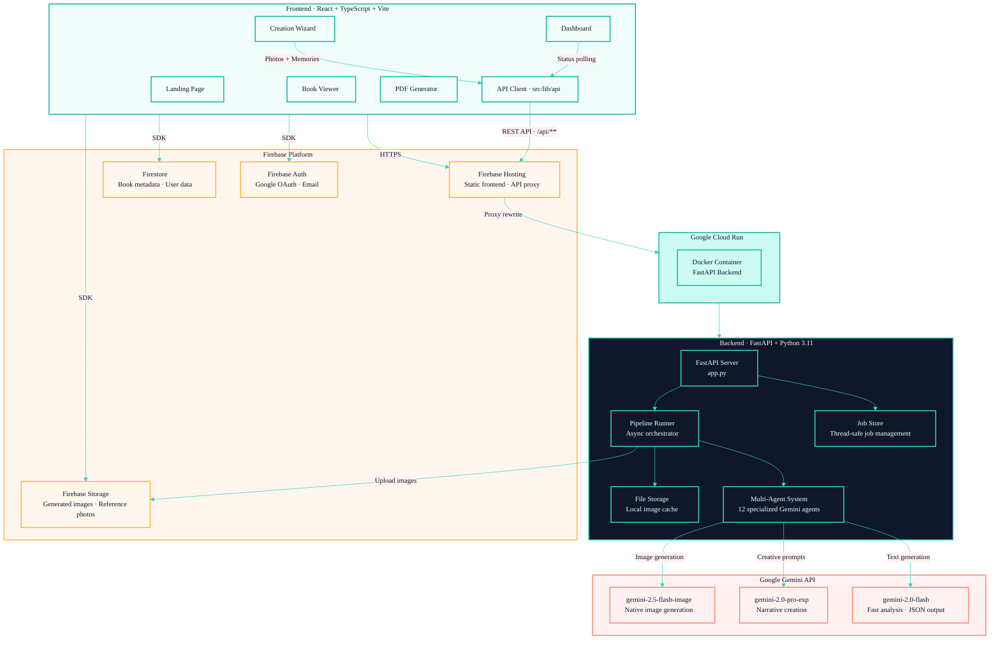
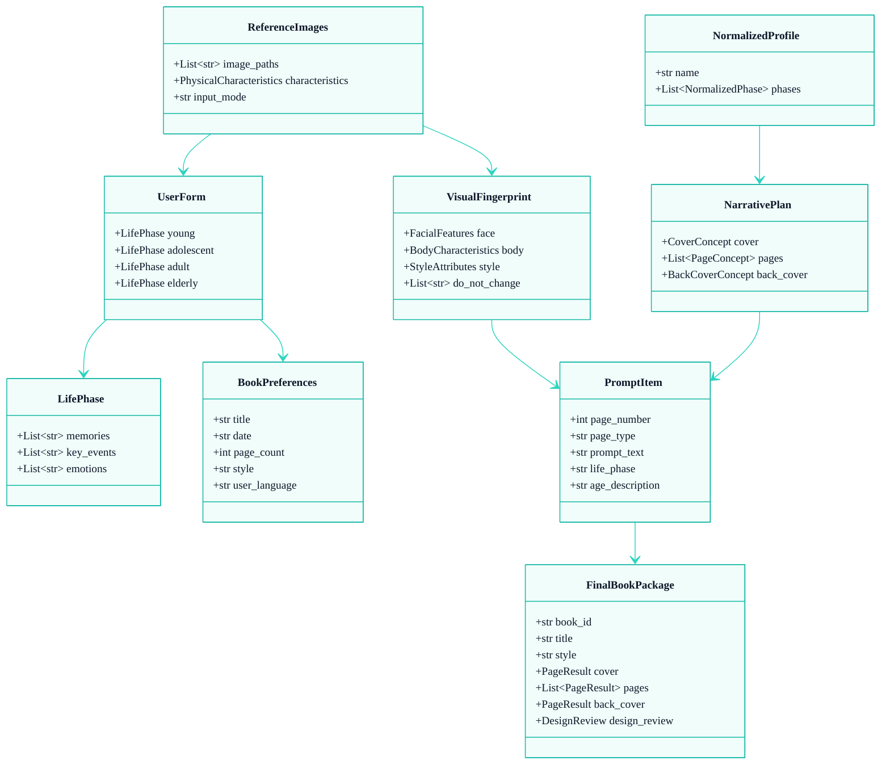

# Memory Book — System Architecture

## System Architecture Diagram

### Main Components

| Layer | Technology | Responsibility |
|-------|-----------|----------------|
| **Frontend** | React 19 + TypeScript + Vite 7 | Wizard interface, dashboard, book viewer, PDF generation |
| **Hosting** | Firebase Hosting | Serve static frontend + reverse proxy to API |
| **Backend** | FastAPI + Python 3.11 | REST API, multi-agent pipeline orchestration |
| **Deployment** | Google Cloud Run | Dockerized backend container |
| **Database** | Firebase Firestore | Book metadata, user data, generation jobs |
| **Storage** | Firebase Storage | Reference photos and generated images (public URLs) |
| **Auth** | Firebase Authentication | Google OAuth and email/password |
| **AI Engine** | Google Gemini API | Text generation, image analysis, illustration generation |

### Data Flow

1. **User** fills in the wizard (memories + reference photos)
2. **Frontend** compresses images and sends `POST /jobs` via API Client
3. **Firebase Hosting** proxies the request to **Cloud Run**
4. **FastAPI** creates the job and triggers the **Pipeline Runner** in the background
5. **Pipeline** orchestrates the **12 agents** sequentially and in parallel
6. **Agents** use the **Gemini API** for analysis, planning, and image generation
7. **Generated images** are saved locally then uploaded to **Firebase Storage**
8. **Frontend** polls for status every 2 seconds via `GET /jobs/{id}`
9. Upon completion, the **final result** is persisted to **Firestore**

---

## Agent Pipeline Diagram

```mermaid
%%{init: {'theme': 'base', 'themeVariables': { 'primaryColor': '#F0FDFA', 'primaryTextColor': '#0F172A', 'primaryBorderColor': '#2DD4BF', 'lineColor': '#475569', 'secondaryColor': '#FFF1F0', 'tertiaryColor': '#CCFBF1', 'fontFamily': 'Nunito, system-ui, sans-serif', 'fontSize': '13px' }}}%%
graph LR
    START(["User Input"])

    subgraph Normalize["1 · Normalize"]
        NORM["Normalizer\n2.0-flash"]
    end

    subgraph Plan["2 · Plan & Analyze · Parallel"]
        direction TB
        NAR["Narrative Planner\n2.0-pro-exp"]
        VIS["Visual Analyzer\n2.0-flash"]
    end

    subgraph CharSheet["3 · Character"]
        CHAR["Character Sheet\n2.5-flash-image"]
    end

    subgraph Prompts["4 · Prompts · Parallel"]
        direction TB
        COV["Cover Creator\n2.0-pro-exp"]
        PWR["Prompt Writer\n2.0-pro-exp"]
        BCO["Back Cover Creator\n2.0-pro-exp"]
    end

    subgraph Review["5 · Review"]
        PREV["Prompt Reviewer\n2.0-flash"]
    end

    subgraph Generate["6 · Generate"]
        IGEN["Image Generation\n2.5-flash-image"]
    end

    subgraph QA["7 · Quality Assurance"]
        direction TB
        IREV["Illustrator Review\n2.0-flash"]
        DREV["Designer Review\n2.0-flash"]
    end

    subgraph Validate["8 · Validate"]
        direction TB
        IVAL["Image Validator\n2.0-flash"]
        IFIX["Iterative Fix\n2.0-flash"]
    end

    FINAL(["Final Book"])

    %% Flow
    START --> NORM
    NORM --> NAR & VIS
    NAR & VIS --> CHAR
    CHAR --> COV & PWR & BCO
    COV & PWR & BCO --> PREV
    PREV --> IGEN
    IGEN --> IREV
    IREV --> DREV
    DREV --> IVAL
    IVAL -->|"Approved"| FINAL
    IVAL -->|"Rejected"| IFIX
    IFIX -->|"Retry"| IGEN

    %% Node styling — Memory Book palette
    classDef startEnd fill:#0F172A,stroke:#2DD4BF,stroke-width:2px,color:#F7FAFC
    classDef normStyle fill:#FFB347,stroke:#E09830,stroke-width:2px,color:#0F172A
    classDef planStyle fill:#CCFBF1,stroke:#14B8A6,stroke-width:2px,color:#0F172A
    classDef charStyle fill:#F0FDFA,stroke:#00E5E5,stroke-width:2px,color:#0F172A
    classDef promptStyle fill:#14B8A6,stroke:#0D9488,stroke-width:2px,color:#FFFFFF
    classDef reviewStyle fill:#2DD4BF,stroke:#14B8A6,stroke-width:2px,color:#0F172A
    classDef genStyle fill:#00E5E5,stroke:#14B8A6,stroke-width:2px,color:#0F172A
    classDef qaStyle fill:#FF8A7A,stroke:#E5756A,stroke-width:2px,color:#FFFFFF
    classDef valStyle fill:#FFF1F0,stroke:#FF8A7A,stroke-width:2px,color:#0F172A

    class START,FINAL startEnd
    class NORM normStyle
    class NAR,VIS planStyle
    class CHAR charStyle
    class COV,BCO,PWR promptStyle
    class PREV reviewStyle
    class IGEN genStyle
    class IREV,DREV qaStyle
    class IVAL,IFIX valStyle

    %% Subgraph styling
    style Normalize fill:#FFF7ED,stroke:#FFB347,stroke-width:1px,color:#0F172A
    style Plan fill:#F0FDFA,stroke:#14B8A6,stroke-width:1px,color:#0F172A
    style CharSheet fill:#F0FDFA,stroke:#00E5E5,stroke-width:1px,color:#0F172A
    style Prompts fill:#F0FDFA,stroke:#14B8A6,stroke-width:1px,color:#0F172A
    style Review fill:#F0FDFA,stroke:#2DD4BF,stroke-width:1px,color:#0F172A
    style Generate fill:#F0FDFA,stroke:#00E5E5,stroke-width:1px,color:#0F172A
    style QA fill:#FFF1F0,stroke:#FF8A7A,stroke-width:1px,color:#0F172A
    style Validate fill:#FFF1F0,stroke:#FF8A7A,stroke-width:1px,color:#0F172A
```

### Agent Details

| # | Agent | Gemini Model | Input | Output | Description |
|---|-------|-------------|-------|--------|-------------|
| 1 | **Normalizer** | `2.0-flash` | UserForm, BookPreferences | NormalizedProfile | Cleans and structures raw form data |
| 2 | **Narrative Planner** | `2.0-pro-exp` | NormalizedProfile, BookPreferences | NarrativePlan | Creates editorial plan with complete narrative arc |
| 3 | **Visual Analyzer** | `2.0-flash` | ReferenceImages, BookPreferences | VisualFingerprint | Extracts facial and physical features from photos |
| 4 | **Character Sheet Generator** | `2.5-flash-image` | VisualFingerprint, BookPreferences | Character Sheet (PNG) | Generates reference portrait for visual consistency |
| 5 | **Cover Creator** | `2.0-pro-exp` | CoverConcept, VisualFingerprint | PromptItem | Creates detailed prompt for the book cover |
| 6 | **Back Cover Creator** | `2.0-pro-exp` | BackCoverConcept, VisualFingerprint | PromptItem | Creates detailed prompt for the back cover |
| 7 | **Prompt Writer** | `2.0-pro-exp` | NarrativePlan, VisualFingerprint | List[PromptItem] | Creates prompts for all internal pages |
| 8 | **Prompt Reviewer** | `2.0-flash` | List[PromptItem] | List[PromptItem] | Reviews and improves prompts before generation |
| 9 | **Illustrator Reviewer** | `2.0-flash` | List[GenerationResult] | List[IllustrationReviewItem] | Assesses artistic quality of illustrations |
| 10 | **Designer Reviewer** | `2.0-flash` | GenerationResults, IllustrationReview | DesignReview | Evaluates overall book design cohesion |
| 11 | **Image Validator** | `2.0-flash` | GenerationResult, VisualFingerprint | ValidationResult | Validates images against plan and fingerprint |
| 12 | **Iterative Fix** | `2.0-flash` | PromptItem, ValidationResult | PromptItem (fixed) | Generates repair prompts for rejected images |

### Visual Consistency Strategies

- **Visual Fingerprint** — Detailed extraction of facial, body, and style characteristics from reference photos
- **Character Sheet** — Generated portrait used as a visual anchor across all pages
- **Cross-reference** — All image generations receive the original photos + character sheet
- **Age adjustment** — Character descriptions are adapted for each life phase
- **"Do Not Change" list** — Critical features that must be preserved in every illustration

### Parallel Execution

The pipeline optimizes execution time by running agents in parallel when possible:

- **Phase 2**: Narrative Planner + Visual Analyzer (concurrent via `asyncio.gather`)
- **Phase 3**: Cover Creator + Back Cover Creator + Prompt Writer (concurrent via `asyncio.gather`)
- **Phase 5**: Up to 2 images generated simultaneously (async semaphore)

---

## API Endpoints

| Method | Endpoint | Description |
|--------|----------|-------------|
| `POST` | `/jobs` | Create new generation job (multipart/form-data) |
| `GET` | `/jobs/{job_id}` | Job status and progress |
| `GET` | `/jobs/{job_id}/result` | Final result (complete book) |
| `GET` | `/jobs/{job_id}/assets` | List assets (references + outputs) |
| `GET` | `/assets/{job_id}/{folder}/{filename}` | Serve image file |
| `GET` | `/jobs` | List recent jobs |
| `DELETE` | `/jobs/{job_id}` | Delete job and its assets |
| `POST` | `/enhance-text` | AI-powered text enhancement |
| `GET` | `/languages` | Supported languages |
| `GET` | `/health` | Health check |

---

## Core Data Models

